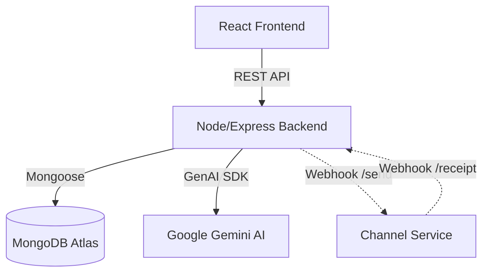

# Xeno AI-Native Mini CRM

A full-stack, AI-driven Customer Relationship Management system featuring an intelligent campaign copilot, automated opportunity detection, and real-time webhook-based event tracking. 

Built as a submission for the Xeno Engineering assignment, this project goes beyond a simple CRUD application to provide a truly "AI-Native" experience that acts as a proactive marketing strategist.

---

## 🏗️ Architecture Overview

The application utilizes a robust Microservice architecture deployed over a monorepo structure.



### 1. Frontend Architecture
- **Framework**: React 18 with Vite
- **Routing**: `react-router-dom`
- **Styling**: TailwindCSS & `shadcn/ui` components
- **State Management**: React Hooks (Custom event listeners for global state like Toasts)
- **Data Visualization**: `recharts` for interactive analytics
- **Key Pages**:
  - `Opportunity Center`: AI-driven predictive insights
  - `Campaign Builder`: "Copilot" guided segment & message generation
  - `Customers`: Fully paginated, sortable server-side data table

### 2. Backend Architecture
- **Framework**: Node.js + Express
- **Database**: MongoDB with Mongoose ODM
- **AI Integration**: `@google/genai` (Gemini 2.5 Flash) with strict prompt engineering and JSON validation
- **API Structure**: Modular RESTful routes (`/api/customers`, `/api/ai`, `/api/campaigns`)
- **Key Features**:
  - Safe, robust AI response JSON parsing with custom fallback mechanisms.
  - Asynchronous background batch processing for Campaign Dispatch using `Promise.allSettled`.
  - Advanced Aggregation Pipelines for funnel metrics.

### 3. Channel Service (Mock ESP)
- A separate microservice running on its own port that mimics an external Email Service Provider or SMS Gateway.
- Processes campaign dispatches asynchronously via `setTimeout` and randomly simulates message states (`delivered`, `failed`, `clicked`, `opened`).
- Communicates back to the main Backend via webhooks to update telemetry data.

---

## 💾 MongoDB Schema Overview

- **Customer**: Stores user profiles. Highly indexed (`totalSpent`, `lastOrderDate`) to support AI segment scans.
- **Segment**: Stores AI-generated JSON filter objects representing audience targeting queries.
- **Campaign**: Stores marketing text, segment relationships, and state (`Draft`, `Sending`, `Completed`, `Failed`).
- **Communication**: Tracks the individual message state for a specific customer in a campaign.
- **Event**: The core telemetry table. Stores timestamped webhook actions (e.g., `open`, `click`). Compound indexed on `campaignId` and `type` for lightning-fast aggregation.

---

## 🧠 AI Workflows

### 1. AI Campaign Copilot Workflow
1. User provides a natural language prompt ("Target users who spent over $500 but haven't ordered in 60 days").
2. Backend calls Gemini to translate prompt into a strictly validated MongoDB JSON filter object.
3. Backend counts the audience size and passes it to the Campaign Strategist AI prompt.
4. Gemini generates a catchy `campaignName`, a highly personalized `campaignMessage`, and a `recommendedChannel`.
5. The backend validates the AI response, strips markdown, and returns the structured payload.

### 2. Automated Opportunity Detection
1. The `opportunity.service.js` continuously scans the database against pre-defined heuristics (Win-back, VIP Upgrade, At-Risk).
2. It aggregates groups of matching customers.
3. It passes the raw aggregated segment data to Gemini to formulate "Insights" (e.g., "142 customers haven't purchased in 60 days, recommend an SMS discount campaign").

---

## ⚙️ Environment Setup & Local Development

### Prerequisites
- Node.js (v18+)
- MongoDB (Local instance or Atlas URI)
- Google Gemini API Key

### Installation

1. **Clone the repository:**
   ```bash
   git clone <repo-url>
   cd xeno-crm
   ```

2. **Setup Environment Variables:**
   - Use the provided `.env.example` templates in each directory.
   - You need `.env` files in `frontend/`, `backend/`, and `channel-service/`.

3. **Install Dependencies:**
   ```bash
   # Run this in all three directories: frontend, backend, channel-service
   npm install
   ```

4. **Seed the Database:**
   ```bash
   cd backend
   node utils/seed.js
   ```

5. **Start the Services:**
   You will need three terminal windows:
   ```bash
   # Terminal 1: Frontend
   cd frontend
   npm run dev

   # Terminal 2: Backend
   cd backend
   npm run dev

   # Terminal 3: Channel Service
   cd channel-service
   npm start
   ```

---

## 🚀 Deployment Instructions

This repository is pre-configured for instant deployment on Vercel and Render.

### Frontend (Vercel)
The `frontend/` directory contains a `vercel.json` configured to handle SPA routing rewrites.
1. Connect the repository to Vercel.
2. Set Root Directory to `frontend`.
3. Add Environment Variable: `VITE_API_URL` (pointing to your Render backend).

### Backend & Channel Service (Render)
The repository contains a declarative `render.yaml` infrastructure-as-code file.
1. Connect Render to the repository.
2. It will automatically detect two Web Services: `xeno-crm-backend` and `xeno-crm-channel-service`.
3. In the Render Dashboard, configure `MONGODB_URI` and `GEMINI_API_KEY` for the backend service.

---

## 📈 Scalability Notes

- **Database**: Analytics queries bypass $O(N)$ collection scans due to added compound indexing on `Event` and `Customer` tables.
- **Dispatch Engine**: The naive IIFE loop was replaced with chunked `Promise.allSettled` batching, resolving memory leak risks and avoiding Node event loop blocking during large campaign rollouts.
- **Security**: The Gemini API parser strictly enforces MongoDB operator whitelists (`$gt`, `$in`, etc.), dropping malicious payloads like `$where` or `$regex`. CORS is dynamically hardened.
